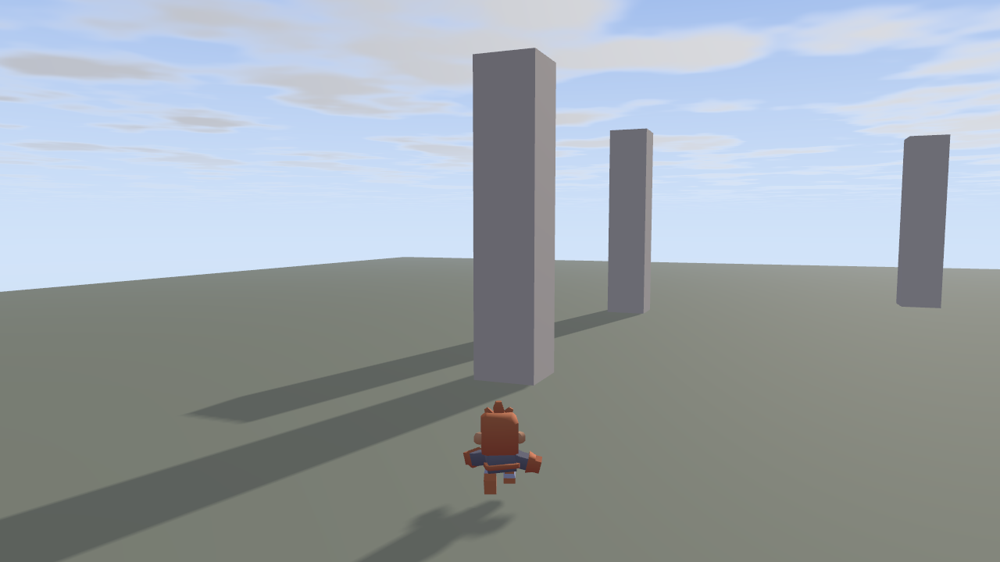
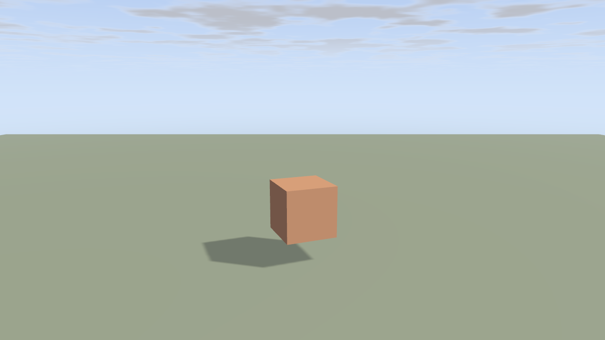
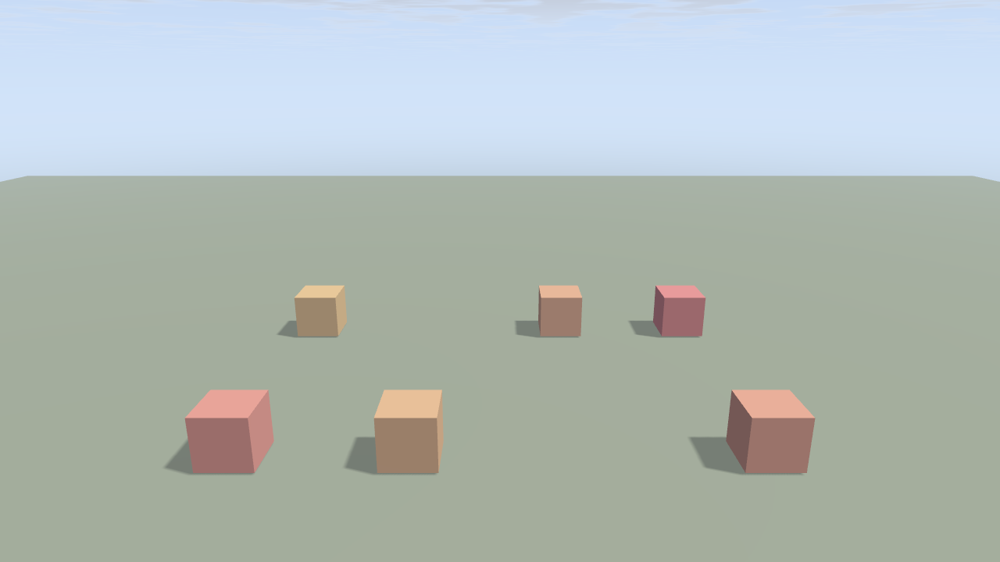
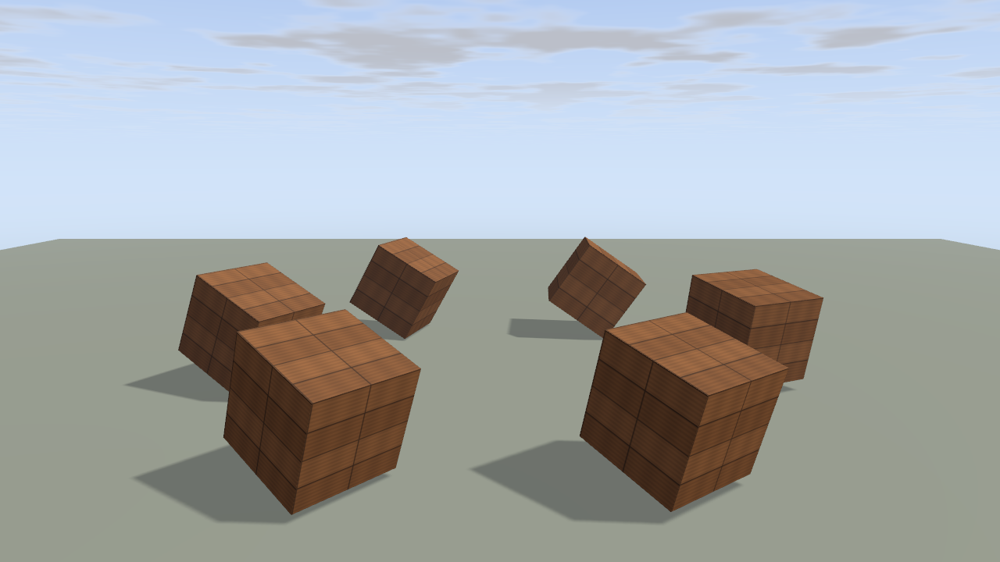
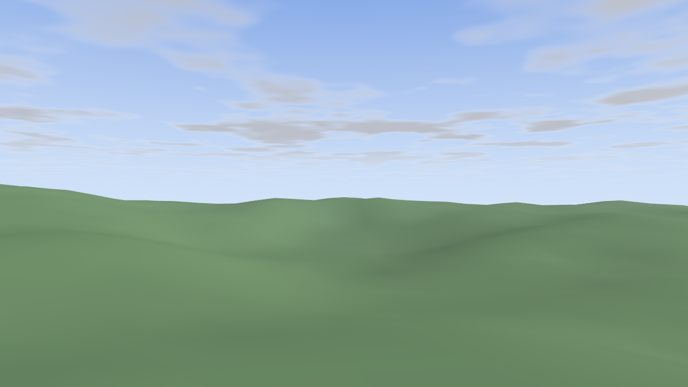

# GlyphEngine

A 3D game engine for Go, built on Vulkan.

Go has no living 3D engine — Ebitengine is 2D, g3n is quiet, Azul3D is gone.
This is an attempt at one, extracted from a working Vulkan MMO rather than
written speculatively.

It is a **library**. Your program owns `main()`; there is no editor and no
runtime that loads your game.

> **Status: v0.x.** APIs break without notice. Pin a commit if you build on it.



*`task example:06-skinned` — a rigged glTF character, GPU skinning, cascaded
shadow maps, and a day/night sky. Every image in this README is captured by the
engine itself with `-screenshot`, not taken by hand.*

## Install

```
go get github.com/derekmwright/glyphengine
```

## Prerequisites

- **Go 1.26+**
- **CGo enabled and a C compiler.** `CGO_ENABLED=0` will not build.
- **Vulkan runtime** and a GPU that supports it
- [go-task](https://taskfile.dev), for the repo's build targets
- Optional: the **Vulkan SDK**, for the validation layer and for recompiling
  shaders

| Platform | Status |
|---|---|
| Windows | Supported, and where development happens |
| Linux | Blocked upstream. `vkngwrapper/core` v3.1.1 is missing an `unsafe` import in `system_nonwindows.go` and does not compile. The fix is merged on `main`; tracking a tag in [vkngwrapper/core#13](https://github.com/vkngwrapper/core/issues/13). |
| macOS | Untested. Expect missing CGo flags and no MoltenVK portability handling. |

## Hello, triangle

```
git clone https://github.com/derekmwright/glyphengine
cd glyphengine
task example:01-triangle
```

If a tri-color triangle appears, your whole toolchain works — CGo, the C
compiler, the Vulkan loader, the driver, GLFW, and the entire
instance → device → swapchain → pipeline → present path. Debug there first
when anything breaks.

## A minimal game

```go
package main

import (
	"log"
	"runtime"

	"github.com/go-gl/mathgl/mgl32"
	glyph "github.com/derekmwright/glyphengine"
	"github.com/derekmwright/glyphengine/input"
)

func init() {
	runtime.LockOSThread() // GLFW must stay on the thread that initialized it
}

type game struct{ camera *glyph.Camera }

func (g *game) Init(e *glyph.Engine) error {
	cube, err := e.Renderer().CreateCube(1.0)
	if err != nil {
		return err
	}

	ent := e.Spawn()
	e.C.Transform.Set(ent, &glyph.Transform{
		Position: mgl32.Vec3{0, 1, 0},
		Scale:    mgl32.Vec3{1, 1, 1},
	})
	e.C.MeshRef.Set(ent, &glyph.MeshRef{Mesh: cube})

	g.camera = glyph.NewCamera(8)
	g.camera.Target = mgl32.Vec3{0, 1, 0}
	return nil
}

func (g *game) Update(e *glyph.Engine, dt float32) {
	if e.Input().KeyPressed(input.KeyEscape) {
		e.Close()
	}
	g.camera.Update(e.Input())
	e.SetCamera(g.camera.ViewVectors())
}

func main() {
	e, err := glyph.New(&game{}, glyph.WithTitle("My Game"))
	if err != nil {
		log.Fatal(err)
	}
	defer e.Destroy()
	e.Run()
}
```

## Loading assets

Every loader takes an `fs.FS`, so the same call works against an `embed.FS`
baked into the binary, an `os.DirFS` pointing at a mod folder, or a test
fixture. The working directory never decides whether your game finds its
assets.

```go
//go:embed assets
var assetsFS embed.FS

tex, err := r.LoadTexture(assetsFS, "assets/crate.png")
model, err := r.LoadGLTFSkinned(assetsFS, "assets/character.glb")
hm, err := glyph.LoadHeightmap(assetsFS, "assets/island.heightmap")
```

## Moving a character

Simulation runs on a fixed tick; rendering runs at the display rate and
interpolates between ticks. Read input per frame in `Update`, move per tick in
`FixedUpdate`:

```go
func (g *game) Update(e *glyph.Engine, dt float32) {
	in := e.Input()
	g.intent = glyph.MoveIntent{Yaw: g.camera.Yaw}
	if in.KeyDown(input.KeyW) { g.intent.Forward++ }
	if in.KeyPressed(input.KeySpace) { g.jumpQueued = true } // latch the edge
}

func (g *game) FixedUpdate(e *glyph.Engine, dt float32) {
	intent := g.intent
	intent.Jump = g.jumpQueued
	g.jumpQueued = false
	e.MoveCharacter(g.player, intent, dt)
}
```

That split is why movement is reproducible: identical inputs give
bit-identical results at 60Hz and at 300Hz.

## Packages

| Package | What it does |
|---|---|
| `glyphengine` | Root. `Engine` (window, frame loop), `Scene` (simulation), components, physics, terrain, cameras, character controller |
| `glyphengine/ecs` | Generic ECS — typed `Store[T]`, `Query2/3/4` |
| `glyphengine/renderer` | Vulkan renderer: forward + reverse-Z, cascaded shadows, GPU skinning, MSDF text, instanced grass, particles |
| `glyphengine/window` | GLFW window and Vulkan surface |
| `glyphengine/input` | Keyboard, mouse, cursor capture |
| `glyphengine/audio` | 3D positional audio (miniaudio) |
| `glyphengine/ui` | Immediate-mode widgets |
| `glyphengine/ui/yamlui` | Declarative YAML UI with data bindings |
| `glyphengine/shaders` | Embedded SPIR-V, overridable via `renderer.ShaderSet` |

## Examples

One concept each. Examples 01–04 and 07 load nothing from disk. Every one
takes `-screenshot out.png` to capture its last frame.

| | |
|---|---|
|  `02-cube` |  `03-physics` |
|  `05-textures` |  `07-terrain` |

```
task example:01-triangle      # window, renderer, input loop
task example:02-cube          # Game, Scene, entities, orbit camera, day/night
task example:03-physics       # colliders, gravity, spatial grids, picking
task example:04-first-person  # FP camera, MoveIntent, character controller
task example:05-textures      # loading assets from an embedded filesystem
task example:06-skinned       # rigged glTF character, GPU skinning, clip blending
task example:07-terrain       # heightmap as both collision and geometry
```

## Building

```
task build     # engine and examples
task test      # unit tests, no GPU needed
task lint      # gofmt, then go vet
task smoke     # render real frames of every example
task validate  # every example under the Vulkan validation layer
task ci        # lint, build, test, race
```

## Documentation

- [`docs/agents/`](docs/agents) — one page per capability, with working code
  and the failure modes that matter
- [`AGENTS.md`](AGENTS.md) — architecture, invariants, and the rules that are
  expensive to get wrong
- [`examples/`](examples) — runnable programs

## License

MIT. See [`LICENSE`](LICENSE), and [`THIRD_PARTY.md`](THIRD_PARTY.md) for
vendored code.
