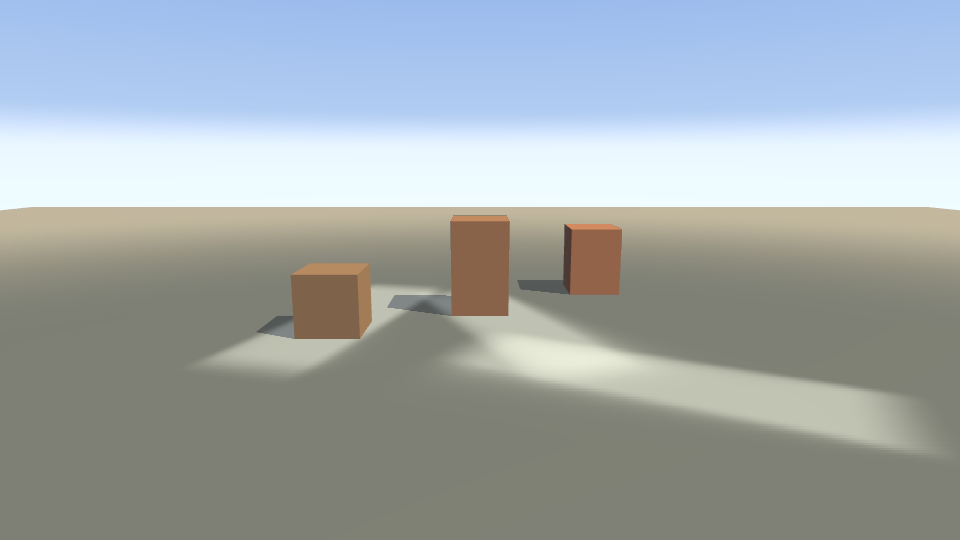

# Examples

One concept per example. Run any of them with:

```
task example:<name>
```

Each is a complete, self-contained `main()` — copy one and start editing.

| # | Name | Teaches | Assets |
|---|---|---|---|
| 01 | `01-triangle` | Window, renderer, input loop, the Vulkan smoke test | none |
| 02 | `02-cube` | `Game`, `Scene`, entities and components, orbit camera, day/night | none |
| 03 | `03-physics` | Colliders, gravity and ground snapping, spatial grids, mouse picking | none |
| 04 | `04-first-person` | First-person camera, `MoveIntent`, character controller, wall collision | none |
| 05 | `05-textures` | Loading assets from an `fs.FS` — embedded or on disk | 1 generated PNG |
| 06 | `06-skinned` | Rigged glTF, GPU skinning, clip selection and cross-fade | Kenney CC0 character |
| 07 | `07-terrain` | Procedural heightmap as both collision and geometry, walking over terrain | none |
| 08 | `08-grass` | Instanced flora scattered from the heightmap, density masking | Quaternius CC0 grass |
| 09 | `09-water` | Gerstner-wave lake with refraction, Fresnel sky reflection, and depth absorption; `-water` adds `x/water`'s underwater volume | none |
| 10 | `10-text` | MSDF text over a 3D scene, one atlas from caption to headline size | Go Regular, generated by `task font` |
| 11 | `11-lights` | One shadow-casting point light and several unshadowed fill lights | none |
| 12 | `12-particles` | Three emitters: fireflies, sparks, dust, drawn as additive billboards | none |
| 13 | `13-ui` | Immediate-mode HUD: panels, progress bars, MSDF labels, one mesh; `-glow on` adds a second panel whose elements emit through the UI glow layer | Go Regular, generated by `task font` |
| 15 | `15-kitchen-sink` | Everything at once: character running over lit terrain, through grass, with a text overlay | Kenney + Quaternius CC0, Go Regular |
| 16 | `16-materials` | Normal, metallic-roughness, occlusion and emissive maps, one added per panel; the emissive one emits above 1 and drives the bloom | none (all five generated at startup) |
| 17 | `17-input` | Named actions across keyboard, mouse and gamepad, with a live device readout and runtime rebinding | none |
| 18 | `18-translucent` | Blended world geometry: a placement ghost over solid buildings, and overlapping glass panes that prove the back-to-front sort | none |
| 19 | `19-instanced` | The same field of 900 props drawn two ways, so one draw call can be compared against 900 | none |
| 20 | `20-screens` | Main menu, world and pause menu: scene swapping, `SetTimeScale`, and keyboard-navigable widgets | Go Regular, generated by `task font` |
| 21 | `21-streetlights` | Clustered spot and point lights at night with scotopic color shift, PBR-mapped walls and heightmap terrain; `-volumetric 1` makes the cones visible beams | none |
| 22 | `22-level` | A level loaded from one glTF: node `extras`, `KHR_lights_punctual`, per-node placement (several nodes sharing one mesh, non-uniform scale plus rotation) | generated by `examples/22-level/gen` |
| 24 | `24-custom-passes` | Additive light target, compute history smoothing, custom lit sampling, and depth-aware half-resolution fog; `-passes off` is the control, `-timings` prints GPU brackets | none |
| 25 | `25-lod-forest` | 3,600 trees over the terrain heightmap: per-instance culling, distance levels, dithered transitions, an eight-view impostor, and a single-level control | procedural |
| 26 | `26-mesh-ranges` | 400 distinct procedural patches drawn three ways: one mesh each, ranges of one shared arena, and the same ranges through indirect batches; `-mode` and `-count` select, `-index32=false` stores uint16 indices | procedural |
| 27 | `27-streaming` | 400 procedural patches published two per rendered frame while the scene draws, three ways: synchronous device-local meshes, host-visible dynamic meshes, and the batched asynchronous uploader; `-mode`, `-count` and `-per-frame` select | procedural |
| 28 | `28-overdraw` | The overdraw baseline: 1,024 terrain patches sharing one five-map material under 196 clustered lights, laid out so a grazing view hides most of them behind each other, with `-overlap=false` as the no-overlap control; both arms measure their own screen-space depth complexity and fail if it has drifted. Nothing to look at -- it is what a depth prepass or occlusion culling gets measured against | procedural |
| 29 | `29-ridge` | The occlusion baseline: 6,000 LOD trees on both flanks of a procedural ridge, camera low on one side so the far flank and most of the near one are hidden, with `-arm open` as the overhead nothing-hidden control; both arms measure the share of placements the terrain hides and fail if it has drifted. Nothing to look at -- it is what occlusion culling gets measured against, and what measured and rejected the hierarchical-Z test of #154 | procedural |

More land as the extraction proceeds — glTF loading, skinned animation,
shadows, MSDF text, YAML UI, audio, and particles. Numbering has gaps on
purpose: each slot is reserved for the concept it will teach, so the ladder
stays in a sensible reading order as it fills in. See `docs/agents/` for
capability-level documentation.

## Notes

**Start with `01-triangle`.** It loads nothing from disk, so if it runs your
toolchain is correct. Debug there before anything else.

**This is a separate Go module.** `examples/go.mod` exists so that `go get` of
the engine never downloads example code or assets. It carries a
`replace github.com/derekmwright/glyphengine => ../` so the examples build from
a plain `git clone`; the root `go.work` covers the same thing for workspace
users. If you copy an example into your own project, drop that `replace` and
`go get github.com/derekmwright/glyphengine` instead.

**Some examples import `x`.** `07-terrain` and `25-lod-forest` build their island
with `github.com/derekmwright/glyphengine/x/terrainfield`, and `09-water -water`
adds `github.com/derekmwright/glyphengine/x/water` -- the third module in
this repository -- the one for systems that have *a look* rather than a mechanism,
so the engine does not have to pick an island for you
([ADR 0012](../docs/adr/0012-an-x-module-for-opinionated-systems.md),
[`x/README.md`](../x/README.md)). It was `examples/internal/terrainfield`, which
nothing outside here could reach. For a game an `x` package is a normal import:
`go get github.com/derekmwright/glyphengine/x` alongside the engine. The
dependency runs one way only -- the examples may import the engine and `x`, and
neither may import the examples.

**`-screenshot out.png`** writes a PNG of the last rendered frame, captured by
the engine itself rather than by an external grabber. Combined with `-frames N`
it is reproducible, which is how the images in the README are made.

**`-frames N`** makes an example render a fixed number of frames and exit, which
is how the smoke test and CI drive them without a human closing a window.

**`09-water -water`** is the one flag here that has to be watched rather than
measured. The engine's water is a surface; walk under it without the flag and
the world is flat grey, because none of what that surface does is visible from
below. With the flag, `x/water` adds the volume -- absorption along the view
ray, the water's own colour filling in behind it, and sun shafts -- and switches
itself off the instant the camera breaks the surface, so the above-water frame
is unchanged. Off by default, so every other capture of this scene is byte for
byte what it was. See [`x/water/water.md`](../x/water/water.md) and
`task xwater`.



`task example:24-custom-passes` -- follow the [render-target walkthrough](../docs/agents/render-targets.md#walkthrough) to build the four application passes.
